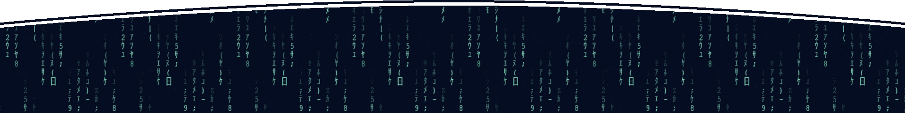

<h2 align="center">
    Hi, Human 🖖
</h2>

    <b>I'm Matheus, a developer passionate about this amazing world of technology.</b>

    Welcome to my GitHub, here you will find my projects and my collaborations for the open source world.

 

    <i>You can find me or contact me through these networks:</i>
      
    
    
    
    

    <i>You can also support me financially via:</i>
      
    

---

    
More about me

    

        I'm a self-taught student, introverted and very observant.  
        I'm currently contributing to the open source world to put into practice the knowledge acquired in my studies. I also help the guys who are starting programming in the communities.
    

    <ul>
        <li>🎓 Technician in System Development by ETEC</li>
        <li>🎯 Contribute and create open source projects</li>
        <li>📚 I'm studying Python | Algorithms | Dev Web | English</li>
        <li>💬 You can ask me questions, I like to help!</li>
        <li>🌑 Observing space</li>
        <li>🎮 Find me in the gaming world: <b>TheuzzLivee</b></li>
    </ul>

    
My GitHub stats

     
    

        
    

    

        
    

    

        
        
    

